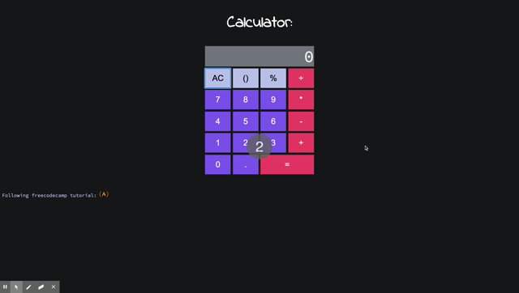

## Calculator :

This calculator has been built using the following technologies:
* Vanilla Javascript
* HTML 5
* CSS - grid layout

Life version of calculator can be found here: [Calculator Link](https://agorodinskaya.github.io/practice/calculator/index.html)

#### External guides :
This project has been created as part of assessment for Generation Australia following tutorial from freecodecamp, please follow the link to see it:
[FreeCodeCamp](https://www.freecodecamp.org/news/how-to-build-an-html-calculator-app-from-scratch-using-javascript-4454b8714b98/)

## Functionality: 

The calculator meets the following requirements :
* The calculator has a JavaScript file with a function that connects each action button and sends an action string as parameter. 
* The calculator has a JavaScript file with a function that connects each numeric button and sends the number as a string as parameter.
* The calculator displays selected numbers.
* The calculator performs the basic mathematical operations (+ - x / ).
* The calculator performs operations with decimal numbers.
* The calculator clear to zero the current value.
* The calculator shows an error message when the user tries to divide by zero.

## Wishlist :

* Refactor the code and add class/ classes instead
* Add more functionalities (e.g. brackets, percentage)
* Make version with more functions

### Known bugs :

The app is in process of testing, bugs when found will be communicated and fixed.

